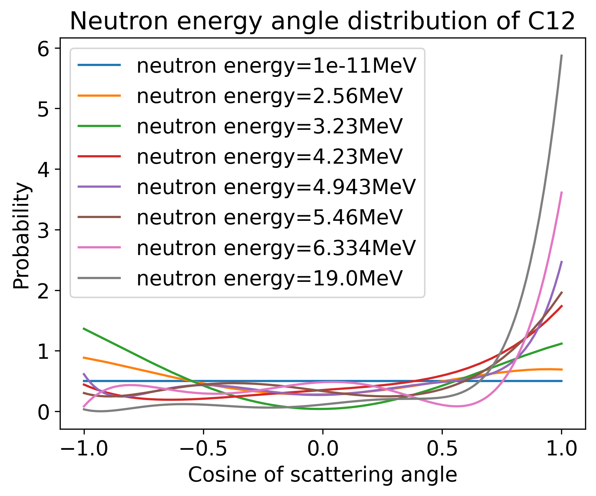
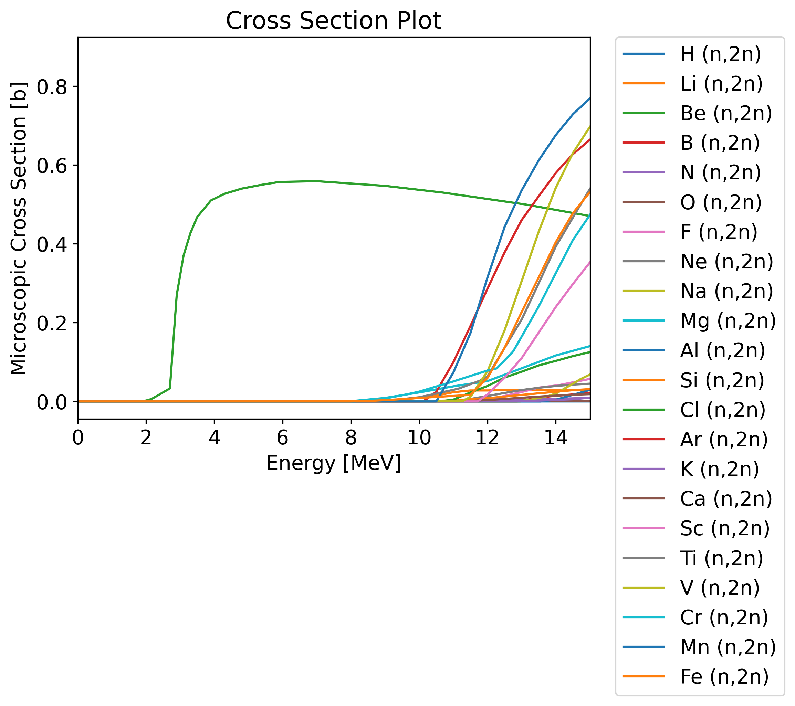

# Nuclear data

  - reactions
  - Isotope chart
  - transmutation reactions
  - Q values
  - threshold reactions
  - fusion fuels (DT,DD ...)
  - energy distribution from DT
  - microscopic cross sections
  - experimental data
  - libraries (ENDF, TENDL, FENDL ...)

  - cross section regions
  - multigroup / continuous energy
  - group structures
  - reaction rate equation
  - macroscopic cross sections
  - scattering / thermalisation
  - decay data
  - photons
  - energy distribution from radioactive material

  <!-- - energy angle plot
  - energy energy plot
  - pathlength
  - equation for logarithmic energy loss
  - transmutation to unstable -->
  <!-- - electrons
  - other particles -->

---

# Reactions

Nuclear reactions notation

Target nuclei (incident projectile, resulting fragments) resulting nuclei
<html>
  <body>
    <svg height="250" width="100%" xmlns="http://www.w3.org/2000/svg">
      <text x="40%" y="50" fill="red" font-size="35">Be9(n,2n)2He4</text>
      <line x1="40%" y1="60" x2="20%" y2="200" style="stroke:red;stroke-width:2" />
      <line x1="47%" y1="60" x2="40%" y2="200" style="stroke:red;stroke-width:2" />
      <line x1="50%" y1="60" x2="66%" y2="200" style="stroke:red;stroke-width:2" />
      <line x1="60%" y1="60" x2="85%" y2="200" style="stroke:red;stroke-width:2" />
      <text x="15%" y="230" fill="red" font-size="35">Target</text>
      <text x="35%" y="230" fill="red" font-size="35">Projectile</text>
      <text x="60%" y="230" fill="red" font-size="35">Product</text>
      <text x="80%" y="230" fill="red" font-size="35">Product</text>
    </svg> 
  </body>
</html>

---

## Neutron induced reactions

 - 999 reactions channels with unique reaction IDs (MT numbers)
 - MT 3 is elastic scattering (n,'n)
 - MT 16 is neutron multiplication (n,2n)
 - MT 18 is neutron multiplication (n,f)
 - MT 205 is tritium production (n,Xt) where X is a wild card
 - MT 444 is damage energy

 [🔗 ENDF reaction numbers](https://www.oecd-nea.org/dbdata/data/manual-endf/endf102_MT.pdf)
 
 ---

## Transmutation reactions

Reactions that result in a change of the isotope

###  No transmutation
(n, elastic)
(n, inelastic)
(n, heating)

### Element transmutation
(n,p)
(n,alpha)
(n,fission)
Be9(n,2n)2He4

### Isotope transmutation

(n, gamma)
Pb208(n,2n)Pb207

---

## Transmutation of lead to gold

[Image source IAEA](https://www-nds.iaea.org/relnsd/vcharthtml/VChartHTML.html)

- 1 stable isotope of gold Au$_{79}^{197}$
- 3 natural isotopes of lead
  - Pb$_{82}^{204}$ ⚛ -3 protons, -4 neutrons
  - Pb$_{82}^{206}$ ⚛ -3 protons, -6 neutrons
  - Pb$_{82}^{207}$ ⚛ -3 protons, -7 neutrons 
  - Pb$_{82}^{208}$ ⚛ -3 protons, -8 neutrons
- 2 reactions for converting gold to lead
  - Pb204 (n,3npa) Au197
  - Pb204 (n,nta) Au197
- No cross section data found in ENDF

---

## Q values

Amount of energy absorbed (-ve) or release (+ve) during the nuclear reaction

| Reaction    | Energy release [MeV] |Threshold reaction |
| -------- | ------- |------- |
| Be9(n,2n)   | -1.6   | Yes  |
| Pb208(n,2n) | -7.3   | Yes  |
| Li6(n,t)    |  4.8   | No   |
| Li7(n,nt)   | -2.4   | Yes  |

Mass and Binding energy converted to kinetic energy

Online Q value calculator at [NNDC](https://www.nndc.bnl.gov/qcalc/)

---

## Fusion fuels

Q values of fusion fuel reactions

| Reaction  | Energy release (MeV) |
| --------- | ------- |
| D + T -> He$^{4}$ + n  |  17.6      |
| D + D -> He$^{3}$+n |   3.3     |
| D + D -> T + p |   4.0     |
| D + He$^{3}$->He$^{4}$+p | 18.3  *     |

* No neutron emitted

---

## Aneutronic Fusion fuels 

- Neutrons are not emitted in the primary fuel reaction
- Neutrons can be emitted by reactions with the products
- Energy capture via direct conversion or divertor?

| Reaction  | Energy release   [MeV] |
| --------- | ------- |
| D + Li$^{6}$ -> 2He$^{4}$ | 22.4       |
| P + Li$^{6}$ -> He$^{4}$ + He$^{3}$    | 4.0       |
| He$^{3}$ + Li$^{6}$ -> He$^{4}$ + p  | 16.9       |
| He$^{3}$ + He$^{3}$ -> He$^{4}$ + 2p  | 12.86       |
| p + Li$^{7}$ -> 2He$^{4}$ | 17.2       |
| p -> B$^{11}$ -> 3He$^{4}$ | 8.7        |
| p -> N$^{15}$ -> C$^{12}$ + He$^{4}$ |      5.0  |

---

## Energy of neutrons from DT fuel

- A DT plasma has several fusion reactions.
- DT is the most likely reaction.
- DD and TT reactions also occur with lower probabilities.
- All reactions and emit different energy neutrons.

---

## Microscopic Cross Section

- Measured in Barns (1 barn = $10^{-28}m^{2}$)
- Energy dependant
- Cross section evaluations exist for:
  - different incident particles
  - different nuclides
  - different interactions.
- Important neutron reactions plotted
  - Tritium breeding
  - Neutron multiplication

---

## Reaction rate equation

- The reaction rate ($RR$) can be found by knowing the number of neutrons per unit volume ($n$), the velocity of neutrons ($v$), the material density ($p$), Avogadro's number ($N_{a}$), the microscopic cross section at the neutron energy ($\sigma_{e}$) and the atomic weight of the material ($M$).
- This reduces down to the neutron flux ($\phi$), nuclide number density ($N_{d}$) and microscopic cross section $\sigma_{e}$.
- This can be reduced one more stage by making use of the Macroscopic cross section ($\Sigma_{e}$).

$$ RR = \frac{nv\rho N_{a}\sigma_{e} }{M} = \phi N_{d} \sigma_{e} = \phi \Sigma_{e} $$

---

## Macroscopic cross section

- Lithium metatitanate has a material density of 3.4 g/cm3
- When plotting materials the Macroscopic cross section accounts for number density of the different isotopes
- Units for Macroscopic cross section are cm$^{-1}$

---

## Cross section regions

Reactions have characteristics
- resolved resonance
- unresolved resonance
- 1/v section
- thresholds
- scattering

---

## Angular distribution

- The scattering angle varies depending on the energy of the incident neutron
- Low energy neutrons have isotropic scattering (even probability in all directions)
- High energy neutrons are more likely to have a low deflection angle and are forwards bias.

---

## Energy distribution

- There is also data on neutrons released in reactions such as (n,2n).
- The (n,2n) reaction is a threshold reaction and requires energy.
- No run away chain reaction possible.

---

# Experimental data

- Availability of experimental data varies for different reactions and different isotopes.

- Typically the experimental data is then interpreted to create evaluation libraries, such as ENDF, JEFF, JENDL, CENDL.

Source [IAEA nuclear data services](https://nds.iaea.org/dataexplorer/?target_elem=Au&target_mass=197&reaction=n%2Cg)

---

## Nuclear data libraries

There are several groups that produce and distribute nuclear data

- TENDL 2023 🇪🇺 2850 neutron
- JENDL 5 🇯🇵 795 neutron
- ENDF/B-VIII.0 🇺🇸 557 neutron
- JEFF 3.3 🇪🇺 562 neutrons
- BROND 3.1 🇷🇺 372 neutrons
- FENDL 3.2b 🌐 191 neutron
- CENDL 3.2 🇨🇳 272  neutron

---

# Path length

- Path length = 1 / $\Sigma_{T}$
- A 14MeV neutron will lose energy via scattering interactions
- As the neutron energy decreases the path length also decreases
- Path length at thermal energy is more constant

---

# Energy loss

The average logarithmic energy decrement (or loss) per collision ($\xi$) is related to the atomic mass ($A$) of the nucleus

$\xi = 1+ \frac{(A-1)^2}{2A} ln \frac{(A-1)}{(A+1)}$

<table style="width:100%">
  <tr>
    <th></th>
    <th>Hydrogen</th>
    <th>Deuterium</th>
    <th>Beryllium</th>
    <th>Carbon</th>
    <th>Uranium</th>
  </tr>
  <tr>
    <td>Mass of nucleus</td>
    <td>1</td>
    <td>2</td>
    <td>9</td>
    <td>12</td>
    <td>238</td>
  </tr>
  <tr>
    <td>Energy decrement</td>
    <td>1</td>
    <td>0.7261</td>
    <td>0.2078</td>
    <td>0.1589</td>
    <td>0.0084</td>
  </tr>
</table>

---

## Why lithium

- Lithium has a particularly high cross section for tritium production
- Li6 has a very high cross section at low neutron energies
- Li7 has a reasonable cross section at high neutron energies
- Other reaction channels are relativity low
- Often alloyed with Si or other elements to improve material properties (e.g. flammability)

* Elements up to Iron plotted

---

## Why beryllium

- Beryllium has the lowest threshold energy for any isotope with a n,2n reaction.
- This means even low energy 3MeV neutrons can undergo (n,2n) reactions.
- Often alloyed with Ti or other elements to improve material properties (e.g. swelling due to retention)
- Lead is also a popular choice for a neutron multiplier

* Elements up to Iron plotted

---

## Other materials

## Tungsten

- High atomic number = good gamma attenuation

- High neutron capture resonances = good neutron attenuation

## Water

- High hydrogen content = excellent neutron moderator

## Helium 4

- Low interaction cross sections and low density = transparent to neutrons and gammas 

---

## Neutron spectra through materials

