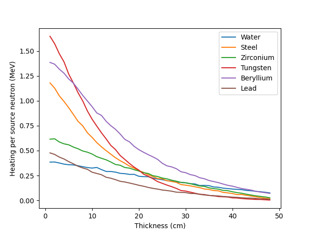

# Prompt responses

  - Neutron wall loading
  - Heating
  <!-- - Gamma production -->
  <!-- - Damage Per Atom (DPA) -->
  <!-- - Gas production -->

  <!-- - Cascades, recombination -->
  - Tritium breeding
  <!-- - Enrichment -->
  <!-- - Neutron multiplication -->
  - Dose

---

# Neutron wall loading

- Energy carried by uncollided source neutrons incident on a unit area of first wall per unit time
- Units typically used $MW m^{-2}$ 
- Useful for estimating neutronics results and scaling or comparing results
- For simple source distributions and geometry, can calculate analytically
- Complex source distributions or geometries require more sophisticated methods (e.g Monte Carlo)

---

# Neutron wall example

- Significant poloidal variation of neutron wall loading occur in toroidal magnetic confinement fusion reactors

source http://dx.doi.org/10.13182/FST13-751

---

# Nuclear Heating

- Energy deposition calculated from the flux using “Kinetic Energy Released in MAterials” (KERMA) factors
- Energy lost by a neutron from a collision is assumed to be deposited locally
- Gamma photons produced by neutrons are transported to determine where their energy is deposited (need coupled neutron-photon transport)
- The power density distribution is used in thermal-hydraulics calculations and subsequent structural analysis (e.g. thermal stress)
- Total heating is used for sizing cooling systems
- Nuclear energy multiplication (Mn) is ratio of energy deposited by neutrons and gamma photons in the reactor to neutron energy incident on FW

---

# Nuclear Heating depends on material and location

- At same location with same neutron flux, nuclear heating depends on material
- High-Z materials usually yield higher nuclear heating than low-Z materials
- Gamma heating represents ~85% of nuclear heating in high-Z materials and only ~40% in low-Z materials
- Nuclear heating drops rapidly as we move away from FW

<!-- ---

# Detailed nuclear heating example

- Determine nuclear heating to ensure adequate cooling in components
- Nuclear heating will have localized peaks in higher Z materials (e.g. steel) that are adjacent to moderator regions (e.g. water coolant)  
  - good from an engineering perspective

TODO
plot of heating vs distance with steel and water
mesh plot of heating for geometry with water pipes -->

---

<!-- # Radiation Damage of Materials

- Energetic neutrons produce: 
  - interstitials and vacancies (atomic displacement)
  - transmutations (gaseous and metallic)
- Determined using neutron flux with appropriate reaction cross sections
- Evaluation of effects of radiation damage on mechanical and physical properties is a crucial aspect of development of structural materials for fusion 
- Damage parameters greatly influenced by neutron energy spectrum

TODO DPA vs energy plot of Iron
TODO helium production plot in Iron -->

<!-- --- -->

# Tritium Breeding Ratio

<iframe src="https://prezi.com/embed/rnzt6pjj-xfu/?bgcolor=ffffff&lock_to_path=0&autoplay=1&autohide_ctrls=1&landing_data=bHVZZmNaNDBIWnNjdEVENDRhZDFNZGNIUE43MHdLNWpsdFJLb2ZHanI0eWk1QlBaUER3dVArS1hRQTAxNXdDZWNRPT0&landing_sign=ABm-Z3JCWCuKHnLF1Q-0yjuTsqyWAQdv3CEpUjcYcXk" title="W3Schools Free Online Web Tutorials" width="100%" height="100%"></iframe>

---

<!-- # He/dpa Ratio For Structural Materials

SiC has an order of magnitude higher He/dpa than steel at the FW
He/dpa for V at the FW is lower with modest gradient
SS316 has enhanced He production deep in blanket
Due to 10 wppm B in SS316 along with large Ni content

TODO plot graph of dpa vs depth
TODO plot graph of he production vs depth
TODO plot ratio of dpa to He production
TODO these different materials SiC, steel, Vandium alloy, eurofer

--- -->

# Instantaneous Dose

- Different types of dose, absorbed, equivalent and effective.
- Effective dose is typically used for dose maps.
- Dose coefficients units of $Sv.cm^2$
- Neutron flux ($particles.cm^{-2}s^{-1}$)
- Resulting dose in Sv per second

---