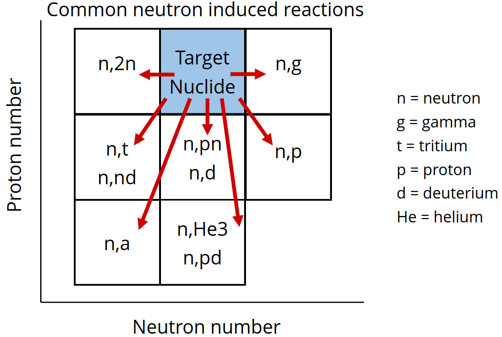
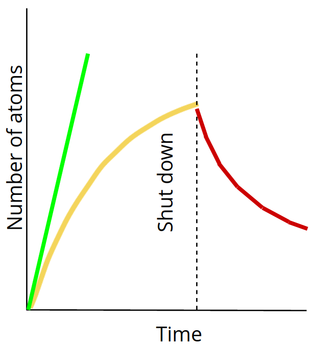
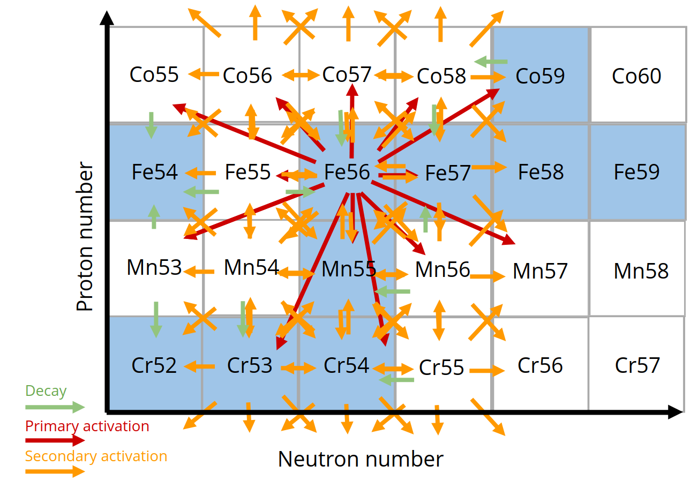
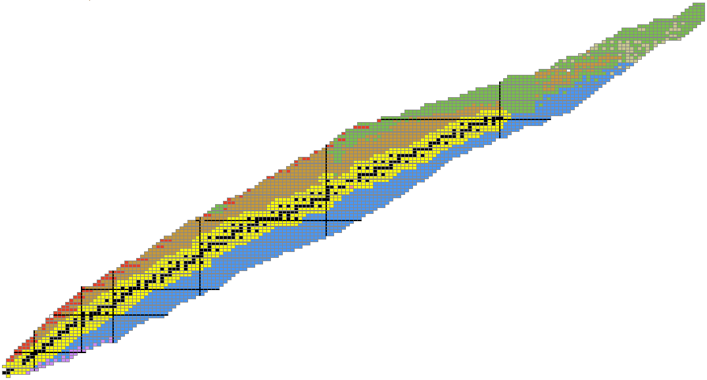
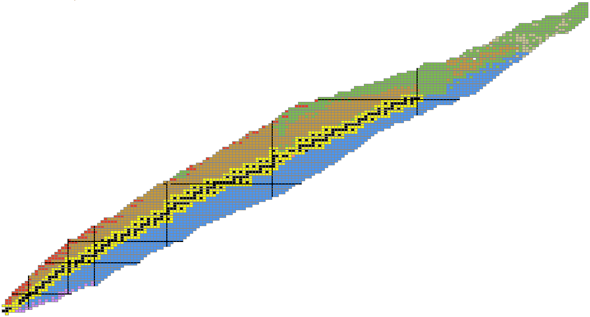
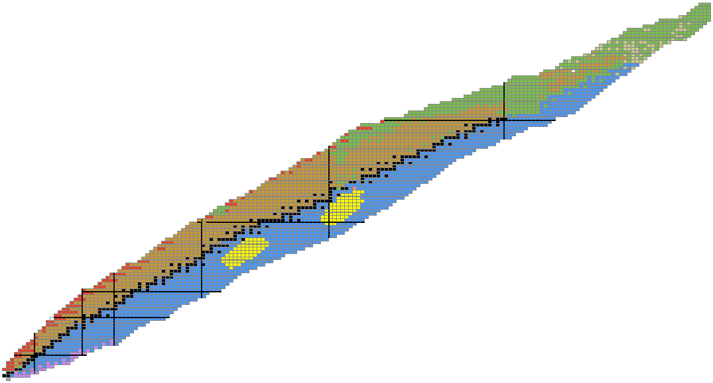
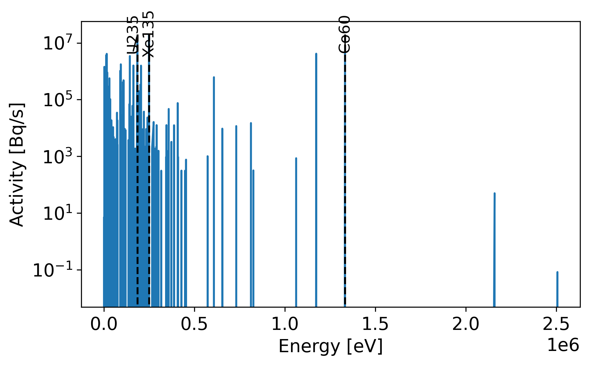
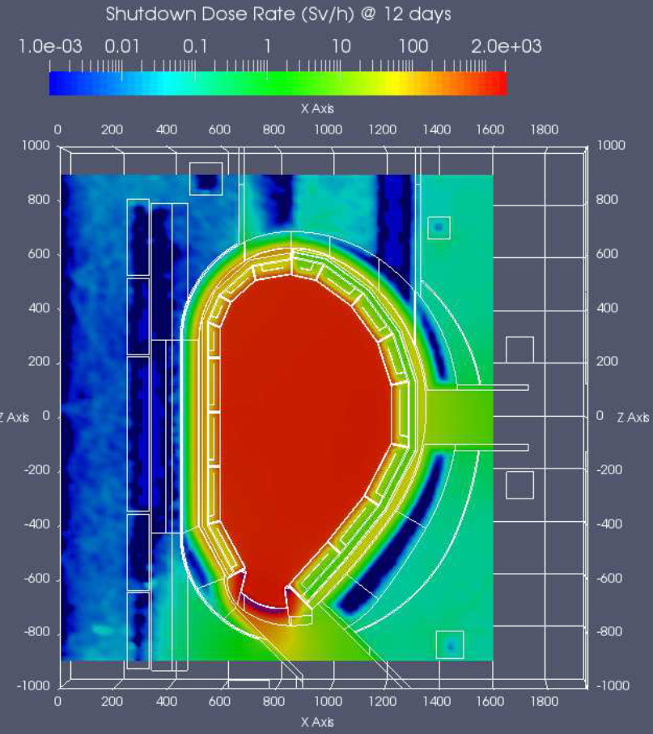
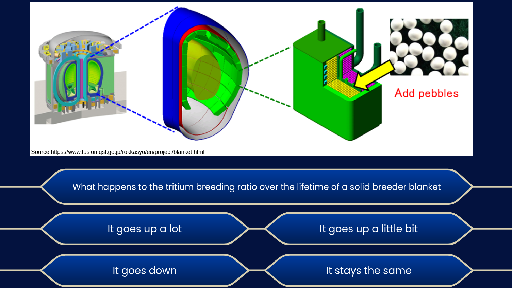

---

# Delayed response

  - Activation
  - Activity build up and decay
  - Emission spectra
  - Shut down dose
    <!-- - Waste -->
  <!-- - Decay heat vs time -->

  - Analysis needed to lift or cool components
  <!-- - Activated coolant -->
  - Impact of burn up on TBR
    <!-- - Shielding -->
  <!-- - Pulsed irradiation / constant irradiation -->

---

# Activation reactions

---

# Build up and saturation

- New isotopes created during irradiation

- Radioactive isotopes decay and will eventually reach a point where decay rate is equal to activation rate.

- Decay is more noticeable once the plasma is shutdown.

- The activity is related to the irradiation time and the nuclide half life.

---

# Activation pathways

---
# Activation products

- High energy neutron activation

- Low energy neutron activation

---

# Activation products from fission

- Fission of large atoms (e.g. U235)
- Results in two fission products far from stability

---

# Emission during decay

- Characteristic gamma energies and intensities emitted
- Reduces with half life of unstable isotope
- Problematic sources in fusion Co60
- Neutrons also emitted by isotopes such as N17 found which is formed by Oxygen irradiation in water

---

# Shut down dose rate

- Post irradiation gamma and even neutron emission from radioactive isotopes continues.
- Gamma and neutrons emitted cause dose field that makes human maintenance difficult.
- This causes components to generate self heating
- Reduced strength of components due to temperature, lift carefully
- Activated coolant pumped outside of the bio-shield

Image source [Eurofusion](https://scipub.euro-fusion.org/wp-content/uploads/eurofusion/WPBBPR17_17590_submitted.pdf)

---

<!-- # Decay heat vs time

cooling components analysis -->

---
