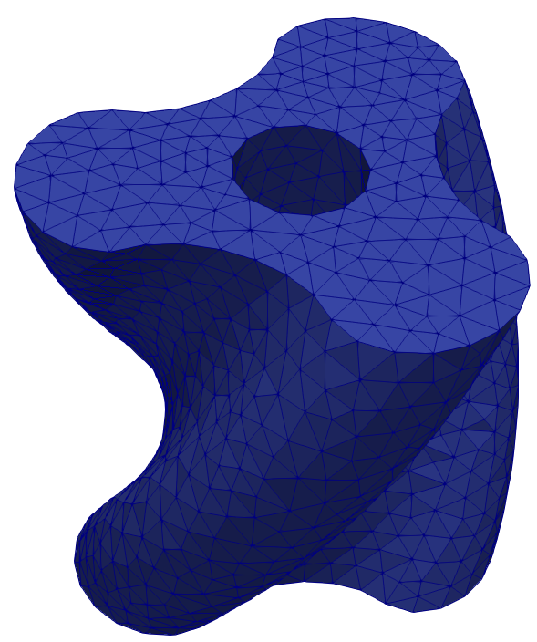
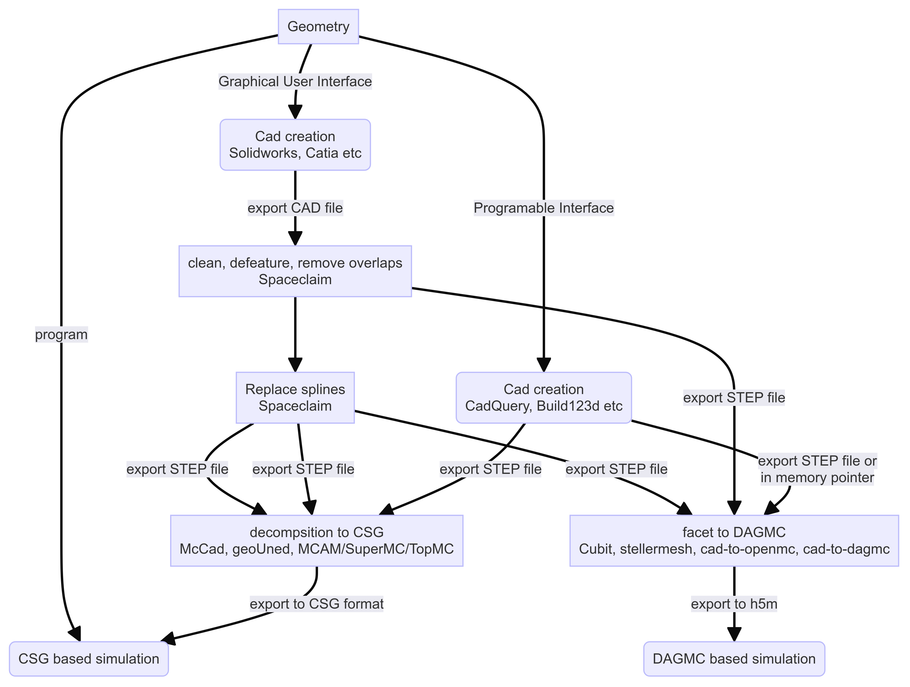
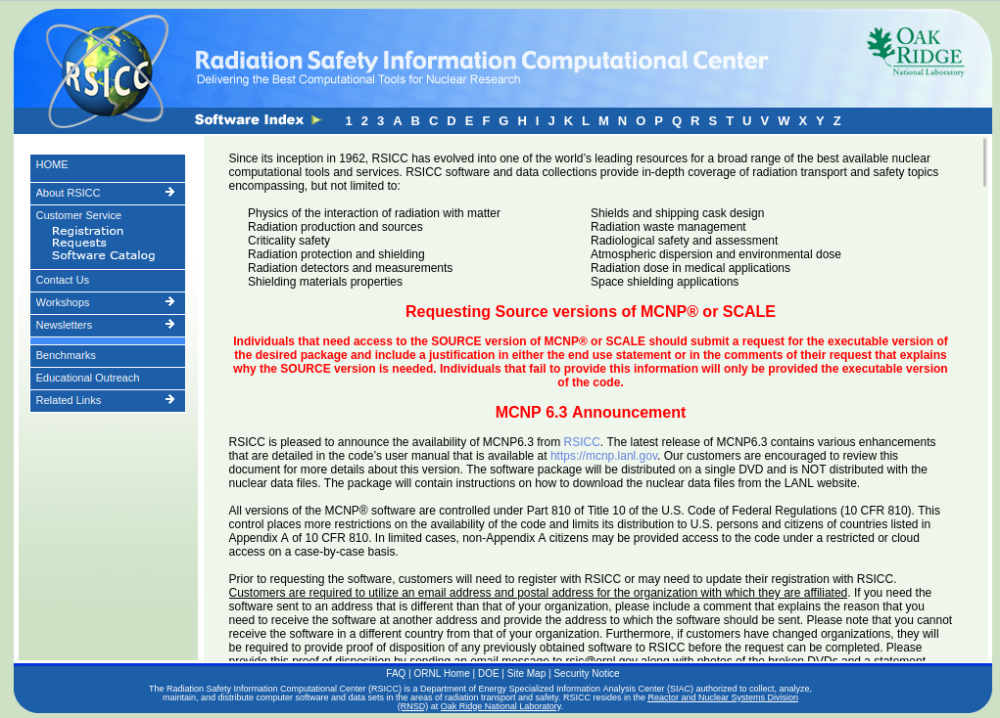
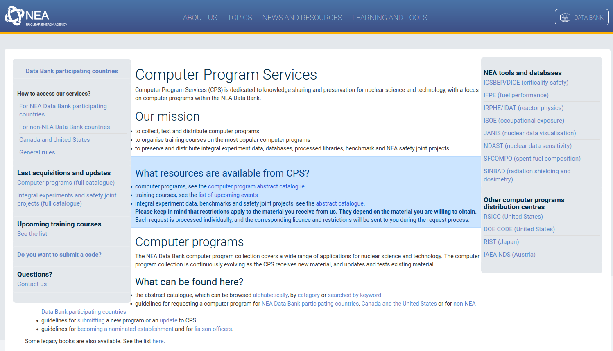

# Overview of neutronics simulation software

- Inventory codes
- Monte Carlo Radiation transport
- Geometry conversion software

---

# Inventory codes

Solving the Bateman equation

| Name of software | Group / community / country | 
|  ----- | -----| 
| ACAB | UNED, Spain | 
| ALARA | Wisconsin, US | 
| Aburn | North China Electrical Power | 
| OpenMC | MIT, ANL, community | 
| Origen | LANL, US | 
| Serpent | VTT, Finland | 
| Fispact | CCFE / UKAEA | 
| Fornax | Silver Fir Software, US | 

---

# Radiation transport

Sampling the Boltzman transport equation

- Stochastic / Monte Carlo is most widely used method in fusion
- Track individual particle histories through phase space
- Random sampling of particle behavior at each event
- Accumulate contributions to the mean behavior from each history
- Variance reduction used to speed up simulation

---

# Monte Carlo Simulations

| Name of software | Group / community / country | 
|  ----- | -----| 
| FLUKA | CERN |
| GEANT | CERN |
| MCNP | LANL | 
| OpenMC | MIT, ANL and open source community |
| Serpent | VTT, Finland |
| TopMC | China |
| TRIPOLI | France |
| SCONE | Cambridge UK |
| MC DC | US |

---

# Geometry for Monte Carlo

CAD to DAGMC convertors
  - cad-to-dagmc
  - cad-to-openmc
  - stl-to-dagmc
  - stellermesh
  - Cubit

CAD to CSG convertors
  - GeoUned
  - McCAD
  - TopMC

---

# Geometry conversion

[Link to flowchat](https://www.mermaidchart.com/raw/bfea01f7-56e6-4780-9687-0a6c99e58b74?theme=light&version=v0.1&format=svg)

---

# Software distribution

Open source codes such as OpenMC and DAGMC are distributed via GitHub, conda.

Some codes used in neutronics are controlled codes under export control

Distribution in the US by RSICC and in the EU by the NEA databank.

[RSICC](http://rsicc.ornl.gov/Default.aspx)

<!-- 
[NEA databank](https://www.oecd-nea.org/dbcps/) -->

---

# Questions

# 📧 mail@jshimwell.com
#  @shimwell

---