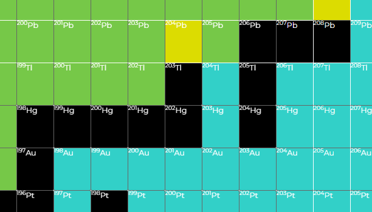
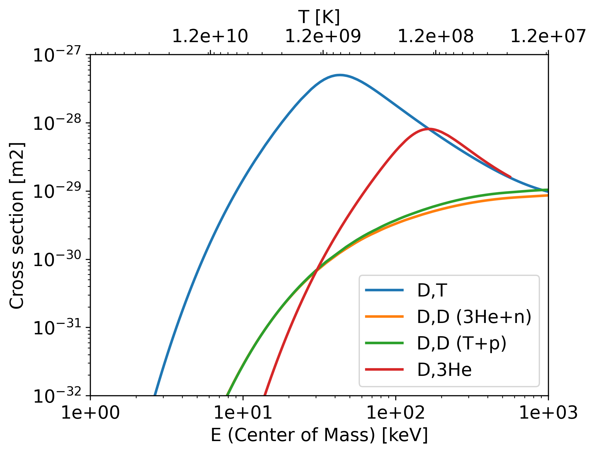
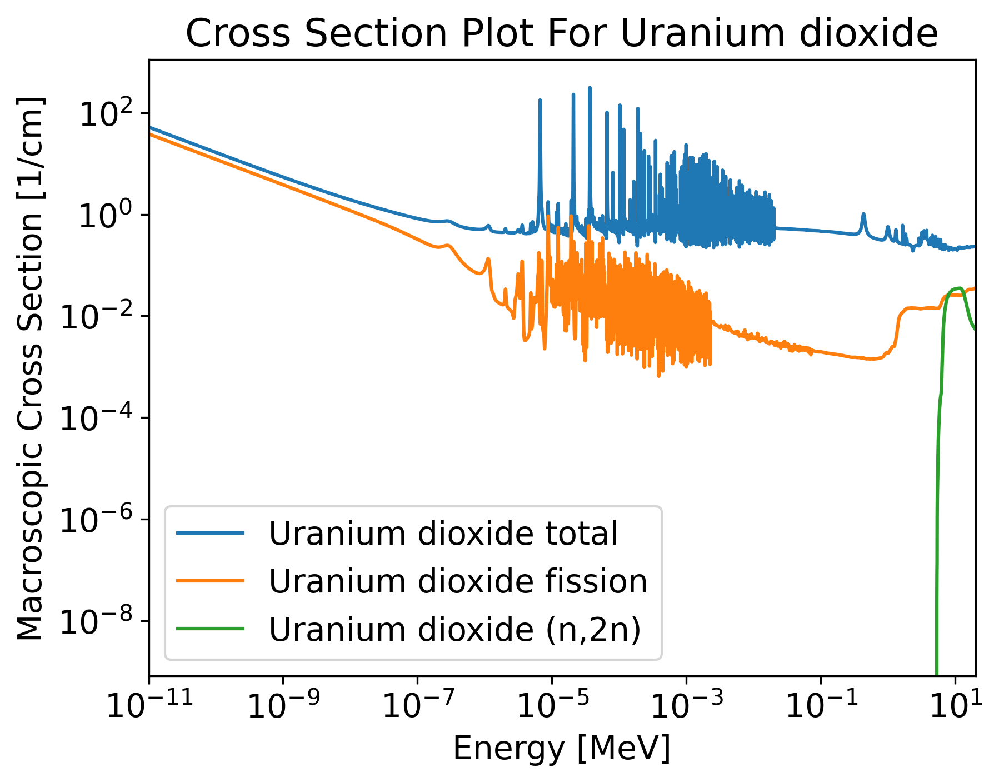
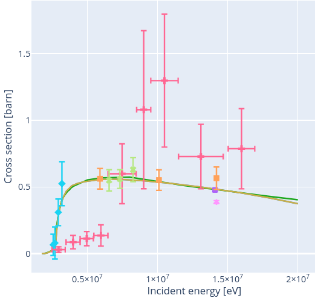
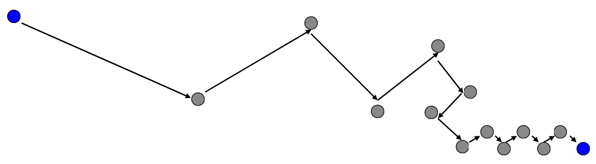
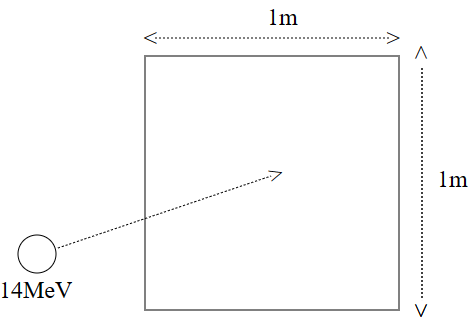
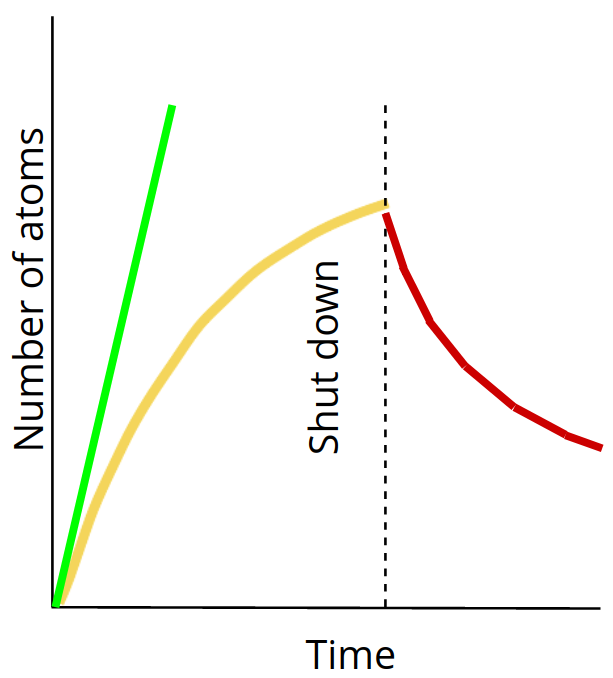
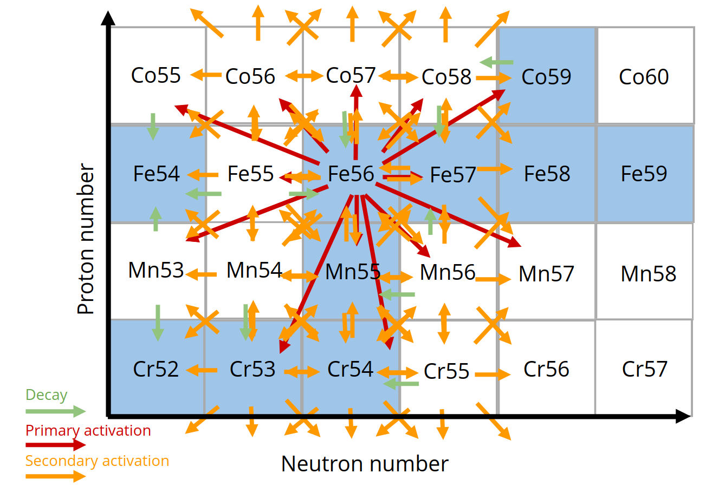
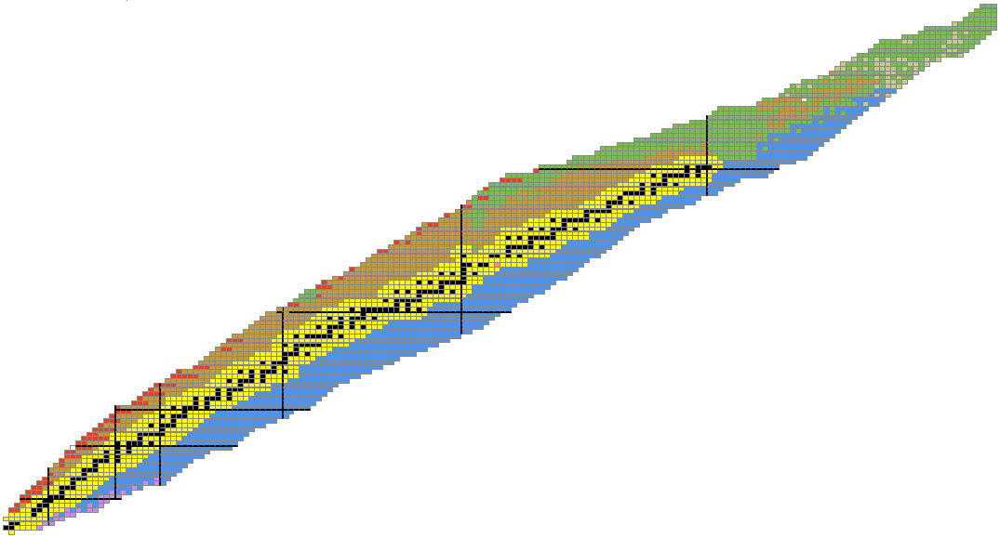
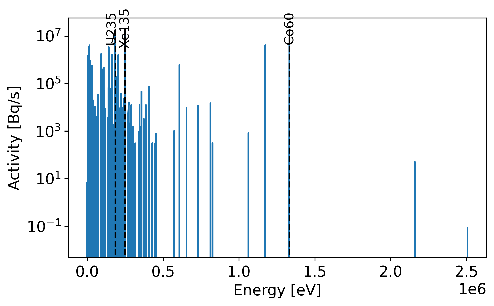

# Neutronics Analysis of Fusion Systems

<!--  -->

Slides available on GitHub
https://github.com/fusion-energy/fusion-neutronics-presentation-slides

---

# Why is neutronics useful

- **Radioactivity** - Neutrons activate material, making it radioactive leading to handling and waste storage requirements.​
- **Hazardous** - Neutrons are Hazardous to health and shielded will be needed to protect the workforce.​
- ***Produce fuel*** - Neutrons will be needed to convert lithium into tritium to fuel the reactor.​
- ***Electricity*** - 80% of the energy release by each DT reaction is transferred to the neutron.​
- ***Structural integrity*** - Neutrons cause damage to materials such as embrittlement, swelling, change conductivity …​
- ***Diagnose*** - Neutrons are an important method of measuring a variety of plasma parameters (e.g. Q value).​

---

# Topics Covered

- Nuclear data
- Prompt responses
- Delayed responses
- Simulation approaches

---

# Nuclear data

  - Reactions
  - Isotope chart
  - Transmutation reactions
  - Q values
  - Threshold reactions
  - Fusion fuels (DT,DD ...)
  - Energy distribution from DT
  - Microscopic cross sections
  - Experimental data
  - Libraries (ENDF, TENDL, FENDL ...)

  - Cross section regions
  - Multigroup / continuous energy
  - Group structures
  - Reaction rate equation
  - Macroscopic cross sections
  - Scattering / thermalisation
  - Decay data
  - Photons
  - Energy distribution from radioactive material

  <!-- - energy angle plot
  - energy energy plot
  - pathlength
  - equation for logarithmic energy loss
  - transmutation to unstable -->
  <!-- - electrons
  - other particles -->

---

# Reactions

Nuclear reactions notation

Target nuclei (incident projectile, resulting fragments) resulting nuclei
<html>
  <body>
    <svg height="250" width="100%" xmlns="http://www.w3.org/2000/svg">
      <text x="40%" y="50" fill="red" font-size="35">Be9(n,2n)2He4</text>
      <line x1="40%" y1="60" x2="20%" y2="200" style="stroke:red;stroke-width:2" />
      <line x1="47%" y1="60" x2="40%" y2="200" style="stroke:red;stroke-width:2" />
      <line x1="50%" y1="60" x2="66%" y2="200" style="stroke:red;stroke-width:2" />
      <line x1="60%" y1="60" x2="85%" y2="200" style="stroke:red;stroke-width:2" />
      <text x="15%" y="230" fill="red" font-size="35">Target</text>
      <text x="35%" y="230" fill="red" font-size="35">Projectile</text>
      <text x="60%" y="230" fill="red" font-size="35">Product</text>
      <text x="80%" y="230" fill="red" font-size="35">Product</text>
    </svg> 
  </body>
</html>

---

# Neutron induced reactions

 - 999 reactions channels with unique reaction IDs (MT numbers)
 - MT 3 is elastic scattering (n,'n)
 - MT 16 is neutron multiplication (n,2n)
 - MT 18 is neutron multiplication (n,f)
 - MT 205 is tritium production (n,Xt) where X is a wild card
 - MT 444 is damage energy

 [🔗 ENDF reaction numbers](https://www.oecd-nea.org/dbdata/data/manual-endf/endf102_MT.pdf)

 

 
 

 

 ---

# Transmutation reactions

Reactions that result in a change of the isotope

###  No transmutation
(n, elastic)
(n, inelastic)
(n, heating)

### Element transmutation
(n,p)
(n,alpha)
(n,fission)
Be9(n,2n)2He4

### Isotope transmutation

(n, gamma)
Pb208(n,2n)Pb207

---

# Transmutation of lead to gold

[Image source IAEA](https://www-nds.iaea.org/relnsd/vcharthtml/VChartHTML.html)

- 1 stable isotope of gold Au$_{79}^{197}$
- 3 natural isotopes of lead
  - Pb$_{82}^{204}$ ⚛ -3 protons, -4 neutrons
  - Pb$_{82}^{206}$ ⚛ -3 protons, -6 neutrons
  - Pb$_{82}^{207}$ ⚛ -3 protons, -7 neutrons 
  - Pb$_{82}^{208}$ ⚛ -3 protons, -8 neutrons
- 2 reactions for converting gold to lead
  - Pb204 (n,3npa) Au197
  - Pb204 (n,nta) Au197
- No cross section data found in ENDF

---

# Q values

Amount of energy absorbed (-ve) or release (+ve) during the nuclear reaction

| Reaction    | Energy release [MeV] |Threshold reaction |
| -------- | ------- |------- |
| Be9(n,2n)   | -1.6   | Yes  |
| Pb208(n,2n) | -7.3   | Yes  |
| Li6(n,t)    |  4.8   | No   |
| Li7(n,nt)   | -2.4   | Yes  |

Mass and Binding energy converted to kinetic energy

Online Q value calculator at [NNDC](https://www.nndc.bnl.gov/qcalc/)

---

# Fusion fuels

Q values of fusion fuel reactions

| Reaction  | Energy release (MeV) |
| --------- | ------- |
| D + T -> He$^{4}$ + n  |  17.6      |
| D + D -> He$^{3}$+n |   3.3     |
| D + D -> T + p |   4.0     |
| D + He$^{3}$->He$^{4}$+p | 18.3  *     |

* No neutron emitted

---

# Aneutronic Fusion fuels 

- Neutrons are not emitted in the primary fuel reaction
- Neutrons can be emitted by reactions with the products
- Energy capture via direct conversion or divertor?

| Reaction  | Energy release   [MeV] |
| --------- | ------- |
| D + Li$^{6}$ -> 2He$^{4}$ | 22.4       |
| P + Li$^{6}$ -> He$^{4}$ + He$^{3}$    | 4.0       |
| He$^{3}$ + Li$^{6}$ -> He$^{4}$ + p  | 16.9       |
| He$^{3}$ + He$^{3}$ -> He$^{4}$ + 2p  | 12.86       |
| p + Li$^{7}$ -> 2He$^{4}$ | 17.2       |
| p -> B$^{11}$ -> 3He$^{4}$ | 8.7        |
| p -> N$^{15}$ -> C$^{12}$ + He$^{4}$ |      5.0  |

---

# Energy of neutrons from DT fuel

- A DT plasma has several fusion reactions.
- DT is the most likely reaction.
- DD and TT reactions also occur with lower probabilities.
- All reactions and emit different energy neutrons.

---

# Microscopic Cross Section

- Measured in Barns (1 barn = $10^{-28}m^{2}$)
- Energy dependant
- Cross section evaluations exist for:
  - different incident particles
  - different nuclides
  - different interactions.
- Important neutron reactions plotted
  - Tritium breeding
  - Neutron multiplication

---

# Reaction rate equation

- The reaction rate ($RR$) can be found by knowing the number of neutrons per unit volume ($n$), the velocity of neutrons ($v$), the material density ($p$), Avogadro's number ($N_{a}$), the microscopic cross section at the neutron energy ($\sigma_{e}$) and the atomic weight of the material ($M$).
- This reduces down to the neutron flux ($\phi$), nuclide number density ($N_{d}$) and microscopic cross section $\sigma_{e}$.
- This can be reduced one more stage by making use of the Macroscopic cross section ($\Sigma_{e}$).

$$ RR = \frac{nv\rho N_{a}\sigma_{e} }{M} = \phi N_{d} \sigma_{e} = \phi \Sigma_{e} $$

---

# Macroscopic cross section

- Lithium metatitanate has a material density of 3.4 g/cm3
- When plotting materials the Macroscopic cross section accounts for number density of the different isotopes
- Units for Macroscopic cross section are cm$^{-1}$

---

# Multigroup cross sections

- Discretize a continuous distribution 
- Histogram of average cross section in each energy bin
- Continuous cross section has rules for interpolation that can be accounted for.
- Groups are not equally spaced.
- Structures are optimized for different energy ranges (fission, fast fission, fusion etc)

---

# Cross section regions

Reactions have characteristics
- resolved resonance
- unresolved resonance
- 1/v section
- thresholds
- scattering

---

## Angular distribution

- The scattering angle varies depending on the energy of the incident neutron
- Low energy neutrons have isotropic scattering (even probability in all directions)
- High energy neutrons are more likely to have a low deflection angle and are forwards bias.

---

# Energy distribution

- There is also data on neutrons released in reactions such as (n,2n).
- The (n,2n) reaction is a threshold reaction and requires energy.
- No run away chain reaction possible.

---

# Experimental data

- Availability of experimental data varies for different reactions and different isotopes.

- Typically the experimental data is then interpreted to create evaluation libraries, such as ENDF, JEFF, JENDL, CENDL.

Source [IAEA nuclear data services](https://nds.iaea.org/dataexplorer/?target_elem=Au&target_mass=197&reaction=n%2Cg)

---

# Nuclear data libraries

There are several groups that produce and distribute nuclear data

- TENDL 2023 🇪🇺 2850 neutron
- JENDL 5 🇯🇵 795 neutron
- ENDF/B-VIII.0 🇺🇸 557 neutron
- JEFF 3.3 🇪🇺 562 neutrons
- BROND 3.1 🇷🇺 372 neutrons
- FENDL 3.2b 🌐 191 neutron
- CENDL 3.2 🇨🇳 272  neutron

---

# Path length

- Path length = 1 / $\Sigma_{T}$
- A 14MeV neutron will lose energy via scattering interactions
- As the neutron energy decreases the path length also decreases
- Path length at thermal energy is more constant

---

# Energy loss

The average logarithmic energy decrement (or loss) per collision ($\xi$) is related to the atomic mass ($A$) of the nucleus

$\xi = 1+ \frac{(A-1)^2}{2A} ln \frac{(A-1)}{(A+1)}$

<table style="width:100%">
  <tr>
    <th></th>
    <th>Hydrogen</th>
    <th>Deuterium</th>
    <th>Beryllium</th>
    <th>Carbon</th>
    <th>Uranium</th>
  </tr>
  <tr>
    <td>Mass of nucleus</td>
    <td>1</td>
    <td>2</td>
    <td>9</td>
    <td>12</td>
    <td>238</td>
  </tr>
  <tr>
    <td>Energy decrement</td>
    <td>1</td>
    <td>0.7261</td>
    <td>0.2078</td>
    <td>0.1589</td>
    <td>0.0084</td>
  </tr>
</table>

---

# Why lithium

- Lithium has a particularly high cross section for tritium production
- Li6 has a very high cross section at low neutron energies
- Li7 has a reasonable cross section at high neutron energies
- Other reaction channels are relativity low
- Often alloyed with Si or other elements to improve material properties (e.g. flammability)

* Elements up to Iron plotted

---

# Why beryllium

- Beryllium has the lowest threshold energy for any isotope with a n,2n reaction.
- This means even low energy 3MeV neutrons can undergo (n,2n) reactions.
- Often alloyed with Ti or other elements to improve material properties (e.g. swelling due to retention)
- Lead is also a popular choice for a neutron multiplier

* Elements up to Iron plotted

---

# Other materials

## Tungsten

- High atomic number = good gamma attenuation

- High neutron capture resonances = good neutron attenuation

## Water

- High hydrogen content = excellent neutron moderator

## Helium 4

- Low interaction cross sections and low density = transparent to neutrons and gammas 

---

# Neutron spectra through materials

By knowing the materials present can you identify which blanket results in which spectrum

- FLiBe, Molten salt, typically 90% enriched Li6
- HCPB, helium cooled pebble bed, typically 60% enriched Li6
- HCLL, helium cooled lithium lead, typically 90% enriched Li6
- WCCB, Water cooled ceramic breeder, typically 60% enriched Li6
- WCLL, water cooled lithium lead, typically 90% enriched Li6
- Liquid Lithium, typically natural enrichment

---

---

---

# Prompt responses

  - Neutron wall loading
  - Heating
  <!-- - Gamma production -->
  <!-- - Damage Per Atom (DPA) -->
  <!-- - Gas production -->

  <!-- - Cascades, recombination -->
  - Tritium breeding
  <!-- - Enrichment -->
  <!-- - Neutron multiplication -->
  - Dose

---

# Neutron wall loading

- Energy carried by uncollided source neutrons incident on a unit area of first wall per unit time
- Units typically used $MW m^{-2}$ 
- Useful for estimating neutronics results and scaling or comparing results
- For simple source distributions and geometry, can calculate analytically
- Complex source distributions or geometries require more sophisticated methods (e.g Monte Carlo)

---

# Neutron wall example

- Significant poloidal variation of neutron wall loading occur in toroidal magnetic confinement fusion reactors

source http://dx.doi.org/10.13182/FST13-751

---

# Nuclear Heating

- Energy deposition calculated from the flux using “Kinetic Energy Released in MAterials” (KERMA) factors
- Energy lost by a neutron from a collision is assumed to be deposited locally
- Gamma photons produced by neutrons are transported to determine where their energy is deposited (need coupled neutron-photon transport)
- The power density distribution is used in thermal-hydraulics calculations and subsequent structural analysis (e.g. thermal stress)
- Total heating is used for sizing cooling systems
- Nuclear energy multiplication (Mn) is ratio of energy deposited by neutrons and gamma photons in the reactor to neutron energy incident on FW

---

# Nuclear Heating depends on material and location

- At same location with same neutron flux, nuclear heating depends on material
- High-Z materials usually yield higher nuclear heating than low-Z materials
- Gamma heating represents ~85% of nuclear heating in high-Z materials and only ~40% in low-Z materials
- Nuclear heating drops rapidly as we move away from FW

<!-- ---

# Detailed nuclear heating example

- Determine nuclear heating to ensure adequate cooling in components
- Nuclear heating will have localized peaks in higher Z materials (e.g. steel) that are adjacent to moderator regions (e.g. water coolant)  
  - good from an engineering perspective

TODO
plot of heating vs distance with steel and water
mesh plot of heating for geometry with water pipes -->

---

<!-- # Radiation Damage of Materials

- Energetic neutrons produce: 
  - interstitials and vacancies (atomic displacement)
  - transmutations (gaseous and metallic)
- Determined using neutron flux with appropriate reaction cross sections
- Evaluation of effects of radiation damage on mechanical and physical properties is a crucial aspect of development of structural materials for fusion 
- Damage parameters greatly influenced by neutron energy spectrum

TODO DPA vs energy plot of Iron
TODO helium production plot in Iron -->

<!-- --- -->

# [Tritium Breeding Ratio](https://prezi.com/embed/rnzt6pjj-xfu/?bgcolor=ffffff&lock_to_path=0&autoplay=1&autohide_ctrls=1&landing_data=bHVZZmNaNDBIWnNjdEVENDRhZDFNZGNIUE43MHdLNWpsdFJLb2ZHanI0eWk1QlBaUER3dVArS1hRQTAxNXdDZWNRPT0&landing_sign=ABm-Z3JCWCuKHnLF1Q-0yjuTsqyWAQdv3CEpUjcYcXk)

<iframe src="https://prezi.com/embed/rnzt6pjj-xfu/?bgcolor=ffffff&lock_to_path=0&autoplay=1&autohide_ctrls=1&landing_data=bHVZZmNaNDBIWnNjdEVENDRhZDFNZGNIUE43MHdLNWpsdFJLb2ZHanI0eWk1QlBaUER3dVArS1hRQTAxNXdDZWNRPT0&landing_sign=ABm-Z3JCWCuKHnLF1Q-0yjuTsqyWAQdv3CEpUjcYcXk" title="W3Schools Free Online Web Tutorials" width="100%" height="100%"></iframe>

---

<!-- # He/dpa Ratio For Structural Materials

SiC has an order of magnitude higher He/dpa than steel at the FW
He/dpa for V at the FW is lower with modest gradient
SS316 has enhanced He production deep in blanket
Due to 10 wppm B in SS316 along with large Ni content

TODO plot graph of dpa vs depth
TODO plot graph of he production vs depth
TODO plot ratio of dpa to He production
TODO these different materials SiC, steel, Vandium alloy, eurofer

--- -->

# Instantaneous Dose

- Different types of dose, absorbed, equivalent and effective.
- Effective dose is typically used for dose maps.
- Dose coefficients units of $Sv.cm^2$
- Neutron flux ($particles.cm^{-2}s^{-1}$)
- Resulting dose in Sv per second

---

---

# Delayed response

  - Activation
  - Activity build up and decay
  - Emission spectra
  - Shut down dose
    <!-- - Waste -->
  <!-- - Decay heat vs time -->

  - Analysis needed to lift or cool components
  <!-- - Activated coolant -->
  - Impact of burn up on TBR
    <!-- - Shielding -->
  <!-- - Pulsed irradiation / constant irradiation -->

---

# Activation reactions

---

# Build up and saturation

- New isotopes created during irradiation

- Radioactive isotopes decay and will eventually reach a point where decay rate is equal to activation rate.

- Decay is more noticeable once the plasma is shutdown.

- The activity is related to the irradiation time and the nuclide half life.

---

# Activation pathways

---
# Activation products

- High energy neutron activation

- Low energy neutron activation

---

# Activation products from fission

- Fission of large atoms (e.g. U235)
- Results in two fission products far from stability

---

# Emission during decay

- Characteristic gamma energies and intensities emitted
- Reduces with half life of unstable isotope
- Problematic sources in fusion Co60
- Neutrons also emitted by isotopes such as N17 found which is formed by Oxygen irradiation in water

---

# Shut down dose rate

- Post irradiation gamma and even neutron emission from radioactive isotopes continues.
- Gamma and neutrons emitted cause dose field that makes human maintenance difficult.
- This causes components to generate self heating
- Reduced strength of components due to temperature, lift carefully
- Activated coolant pumped outside of the bio-shield

Image source [Eurofusion](https://scipub.euro-fusion.org/wp-content/uploads/eurofusion/WPBBPR17_17590_submitted.pdf)

---

<!-- # Decay heat vs time

cooling components analysis -->

---

# Overview of neutronics simulation software

- Inventory codes
- Monte Carlo Radiation transport
- Geometry conversion software

---

# Inventory codes (Bateman equation)

| Name of software | Group / community / country | 
|  ----- | -----| 
| ACAB | UNED, Spain | 
| ALARA | Wisconsin, US | 
| Aburn | North China Electrical Power | 
| OpenMC | MIT, ANL, community | 
| Origen | LANL, US | 
| Serpent | VTT, Finland | 
| Fispact | CCFE / UKAEA | 
| Fornax | Silver Fir Software, US | 

---

# Radiation transport

Sampling the Boltzman transport equation

- Stochastic / Monte Carlo is most widely used method in fusion
- Track individual particle histories through phase space
- Random sampling of particle behavior at each event
- Accumulate contributions to the mean behavior from each history
- Variance reduction used to speed up simulation

---

# Monte Carlo Simulations

| Name of software | Group / community / country | 
|  ----- | -----| 
| FLUKA | CERN |
| GEANT | CERN |
| MCNP | LANL | 
| OpenMC | MIT, ANL and open source community |
| Serpent | VTT, Finland |
| TopMC | China |
| TRIPOLI | France |
| SCONE | Cambridge UK |
| MC DC | US |

---

# Geometry for Monte Carlo

CAD to DAGMC convertors
  - cad-to-dagmc
  - cad-to-openmc
  - stl-to-dagmc
  - stellermesh
  - Cubit

CAD to CSG convertors
  - GeoUned
  - McCAD
  - TopMC

---

# Geometry conversion

[Link to flowchat](https://www.mermaidchart.com/raw/bfea01f7-56e6-4780-9687-0a6c99e58b74?theme=light&version=v0.1&format=svg)

---

# Software distribution

Open source codes such as [OpenMC](https://github.com/openmc-dev/openmc) and [DAGMC](https://star-history.com/#openmc-dev/openmc&Date) are distributed via GitHub, conda.

Some codes used in neutronics are controlled codes under export control

Distribution in the US by RSICC and in the EU by the NEA databank.

[RSICC](http://rsicc.ornl.gov/Default.aspx)

<!-- 
[NEA databank](https://www.oecd-nea.org/dbcps/) -->

---

# Questions

# 📧 mail@jshimwell.com
#  @shimwell

---