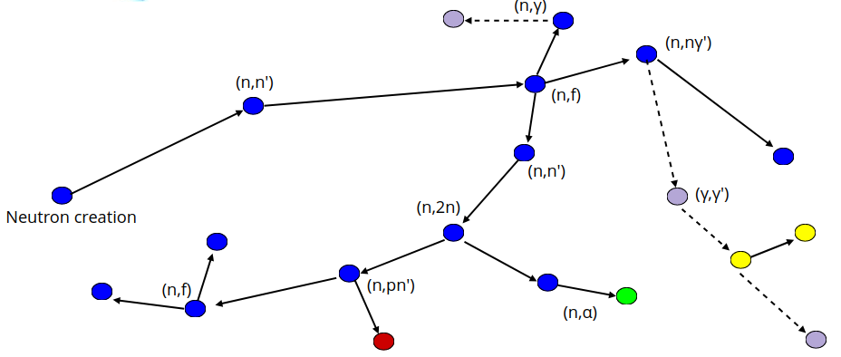
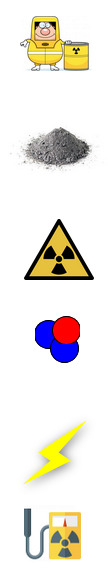

# Fusion Neutronics Workshop

<!--  -->

---

# Why is neutronics useful

- **Radioactivity** - Neutrons activate material, making it radioactive leading to handling and waste storage requirements.​
- **Hazardous** - Neutrons are Hazardous to health and shielded will be needed to protect the workforce.​
- ***Produce fuel*** - Neutrons will be needed to convert lithium into tritium to fuel the reactor.​
- ***Electricity*** - 80% of the energy release by each DT reaction is transferred to the neutron.​
- ***Structural integrity*** - Neutrons cause damage to materials such as embrittlement, swelling, change conductivity …​
- ***Diagnose*** - Neutrons are an important method of measuring a variety of plasma parameters (e.g. Q value).​

---

# Topics Covered 

- Nuclear data
- Prompt responses
- Delayed responses
- Software

---

# Nuclear data
 - reactions
    - transmutation
    - Q values
    - thresholds
    - Fusion fuels

---

# Reactions

## Neutron induced reactions
 - Over 800 reactions channels with unique reaction IDs (MT numbers)
 - MT 16 is neutron multiplication (n,2n)
 - MT 205 is tritium production multiplication (n,2n)
 - MT 444 is damage energy
 
 ### Be9(n,2n)2He4